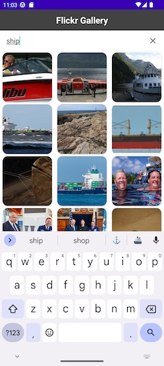
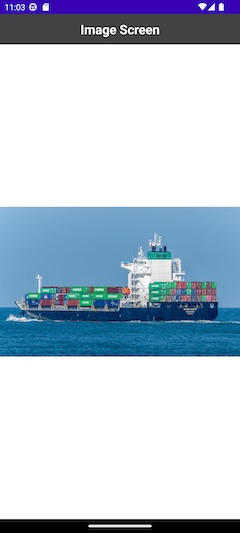

# Flickr Gallery

Android Kotlin project

 

## Features

Uploading from the network (Retrofit 2, URLConnection) 
Data Parser (Gson) 
Architecture (ViewModel) 
Remote Server (Flickr API) 
Image Caching (LruCache) 
Endless list 
Search 
Binding 

## Особенности

Подгрузка из сети (Retrofit 2, URLconnection) 
Парсер данных (Gson) 
Архитектура (ViewModel) 
Удаленный сервер (Flickr API) 
Кэширование изображений (LruCache) 
Бесконечный список 
Поиск 
Биндинг 